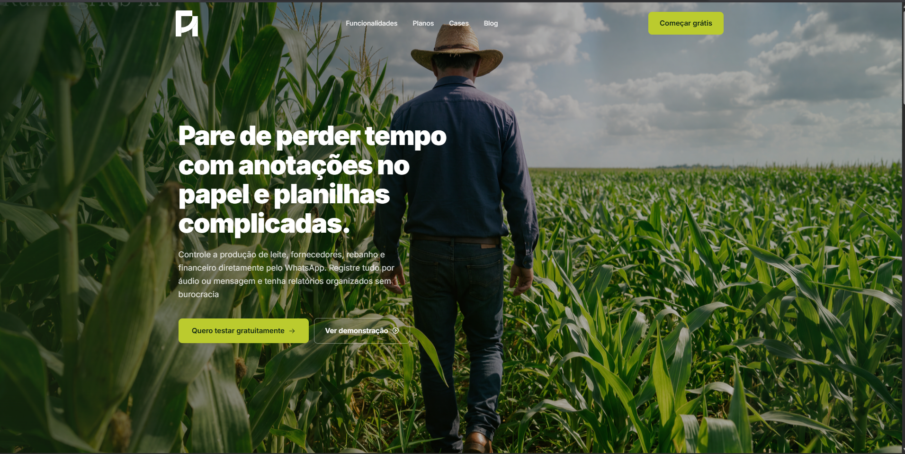
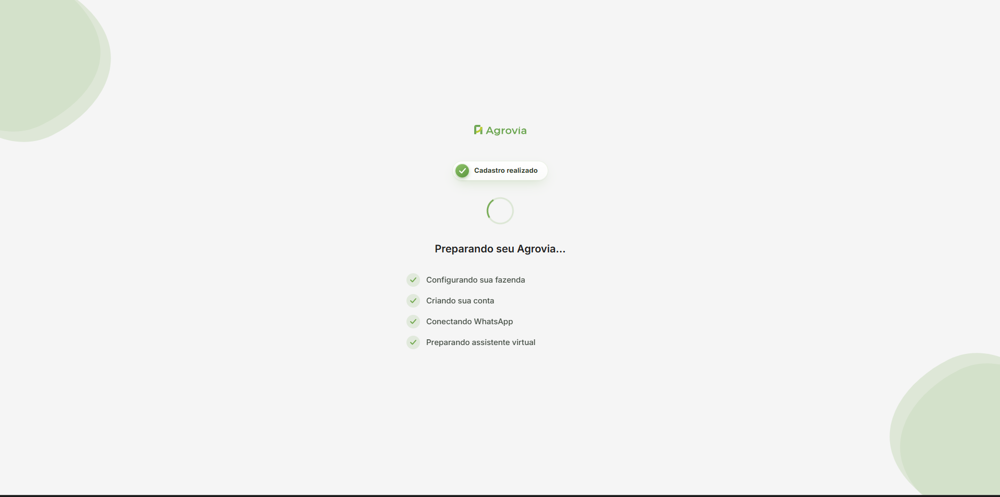
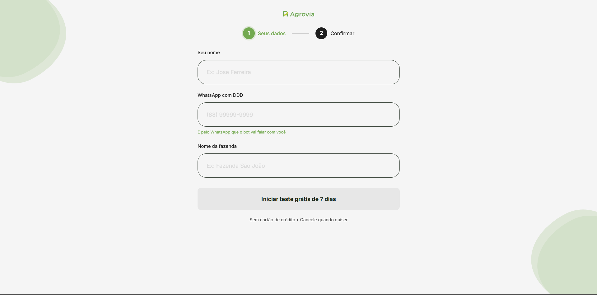

<div align="center">


# Agrovia — Landing Page de Cadastro

**Da fazenda pro WhatsApp em menos de 1 minuto.**

Landing page de cadastro para o teste grátis do **Agrovia**, o assistente virtual que organiza a produção da fazenda direto pelo WhatsApp — sem planilha, sem complicação, só um áudio.

[](#)
[](#)
[](#)
[](#)

</div>

<br/>

## ✨ Sobre o projeto

Esse repositório reúne as páginas públicas do **Agrovia**: o assistente virtual que organiza a produção da fazenda direto pelo WhatsApp — sem planilha, sem complicação, só um áudio.

| Página | Arquivo | Objetivo |
|---|---|---|
| 🏠 Página inicial | [`index.html`](index.html) | Apresentar o Agrovia e converter visitantes em teste grátis |
| 📝 Cadastro | [`cadastro.html`](cadastro.html) | Formulário de teste grátis de 7 dias, com redirecionamento para o WhatsApp |

```
index.html (home)  →  cadastro.html  →  Formulário  →  Processamento  →  Sucesso  →  WhatsApp
```

## 🖼️ Preview

### Página inicial

<div align="center">
  
</div>

### Fluxo de cadastro

<div align="center">
  <table>
    <tr>
      <td align="center"><b>1. Cadastro</b></td>
      <td align="center"><b>2. Processando</b></td>
      <td align="center"><b>3. Sucesso</b></td>
    </tr>
    <tr>
      <td></td>
      <td></td>
      <td width="260" align="center"><sub><i>🚧 print em breve</i></sub></td>
    </tr>
  </table>
</div>

> Assim que tiver o print da tela de sucesso, salve como `assets/img/preview-success.png` e troque a célula acima por:
> ```html
> <td></td>
> ```

## 🚀 Funcionalidades

- **Formulário de 3 campos** — nome, WhatsApp com DDD e nome da fazenda, com máscara automática de telefone
- **Fluxo animado em 3 etapas** — cadastro → processamento (com checklist ao vivo) → sucesso
- **Simulação do WhatsApp** — prévia de como o bot vai conversar com o novo usuário
- **Tratamento de erros robusto** — timeout, falha de rede, erros HTTP e configuração são diagnosticados e traduzidos em mensagens claras para o usuário
- **Zero build step** — Vue 3 e Tailwind via CDN, um único arquivo HTML, sem `npm install`
- **Totalmente responsivo** — mobile-first, testado de 360px a desktop

## 🧱 Stack

| Camada | Tecnologia |
|---|---|
| UI reativa | [Vue 3](https://vuejs.org/) (via CDN, sem build) |
| Estilo | [Tailwind CSS](https://tailwindcss.com/) (via CDN) + CSS customizado |
| Tipografia | [Inter](https://fonts.google.com/specimen/Inter) (Google Fonts) |
| Ícones | SVG inline, sem dependências externas |

## 📂 Estrutura

```
agrovia-bot-lp/
├── index.html               # Página inicial (home/hero)
├── cadastro.html             # Fluxo de cadastro do teste grátis
├── assets/
│   └── img/
│       ├── logo.svg
│       ├── preview-home.png
│       ├── preview-form.png
│       ├── preview-processing.png
│       └── preview-success.png
└── README.md
```

## ⚙️ Configuração

Antes de publicar, ajuste as constantes no topo do `<script>` dentro do `cadastro.html`:

```js
var API_URL      = 'https://SEU-BACKEND.com/api/trial/cadastro'; // endpoint que recebe o cadastro
var API_TIMEOUT_MS = 15000;                                       // timeout da requisição
var BOT_NUMBER    = '55XXXXXXXXXXX';                              // número do bot no WhatsApp
```

> ⚠️ **Importante:** `API_URL` precisa ser um endereço **público** (não `127.0.0.1` ou `localhost`). Se apontar para localhost, só funciona na máquina onde o backend está rodando — visitantes do site não vão conseguir se cadastrar.

## ▶️ Rodando localmente

Como é um site estático, basta servir os arquivos e navegar entre as páginas:

```bash
# Clone o repositório
git clone https://github.com/Jcarlosk/agrovia-bot-lp.git
cd agrovia-bot-lp

# Sirva com um servidor local
npx serve .
```

- Página inicial: `index.html`
- Fluxo de cadastro: `cadastro.html`

## 🗺️ Roadmap

- [ ] Deploy do backend em ambiente de produção
- [ ] Analytics de conversão do formulário
- [ ] Testes A/B na copy do CTA
- [ ] Suporte a múltiplos idiomas

## 📄 Licença

Projeto privado — todos os direitos reservados © Agrovia.

---

<div align="center">
  <sub>Feito com 🌱 para quem vive da terra.</sub>
</div>
